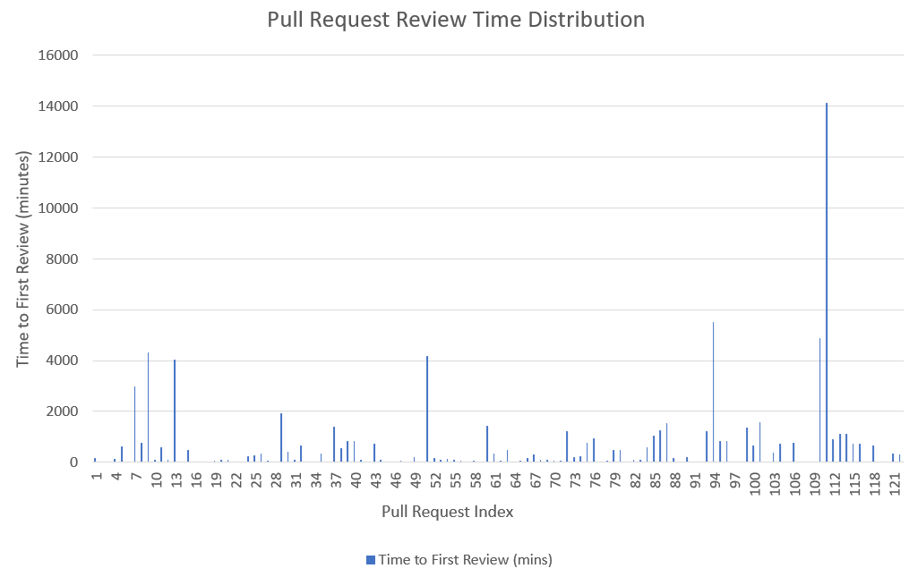
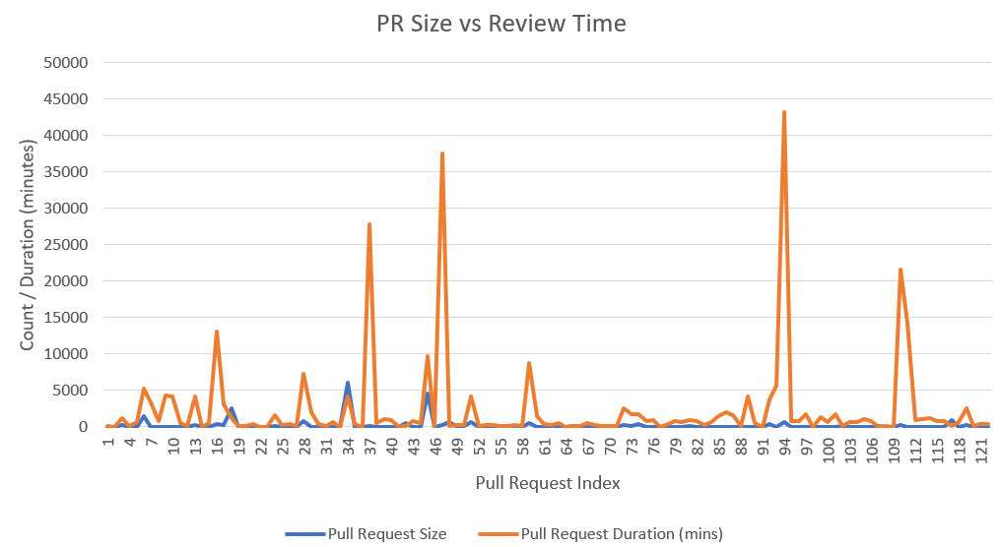
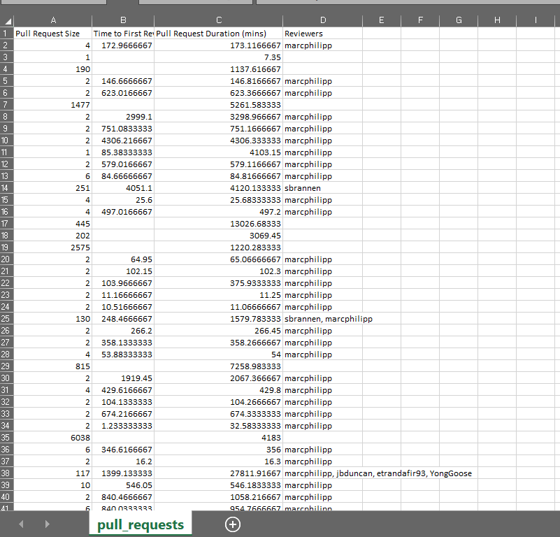

# 📊 Code Review Analytics

Analyze **GitHub Pull Request (PR) review patterns** to unlock insights about efficiency, response time, and PR complexity. This project transforms raw data into compelling visualizations to empower teams to streamline code reviews.

---

##  Why It Matters

Code reviews are crucial yet often opaque. How long do reviews take? Do bigger PRs stall the process? This project answers these questions using real GitHub data.

 What you’ll discover:

-  Review time trends and PR size correlations  
-  Time-to-first-review analytics  
-  Reviewer workload and distribution  
-  PR size impact on review delay  
-  Reproducible unit-tested scripts for reliable evaluation  

---

##  Highlights & Insights

-  Larger PRs take noticeably longer to review  
-  Review times fluctuate wildly — some in minutes, others in days  
-  Some PRs are never reviewed  
-  Number of reviewers doesn’t always mean faster review  

---

## 📂 Repo Structure

```
code-review-analytics/
│
├── .github/                      # GitHub Actions workflow
│
├── images/                       #  Generated visualizations
│   ├── github_actions.png
│   ├── pr_review_distribution.png
│   ├── pr_size_vs_review_time.png
│   └── pull_request_data.png
│
├── analyze_pr_data.py           # Data analysis + plot generation
├── generate_pr_data.py          # GitHub API integration script
├── pr_analysis.py               # Statistical evaluation logic
├── test_fetch_pr_data.py        # ✅ Unit tests for API fetch logic
├── pull_requests.csv            # Collected PR dataset
└── README.md                    #  Project documentation
```

---

##  Sample Visuals

### PR Review Time Distribution  


### PR Size vs Review Time  


### Pull Request Summary  


---

##  Get Started
```bash
1️⃣ Clone This Repo
git clone https://github.com/sshreepadmavathi/code-review-analytics.git
cd code-review-analytics
2️⃣ Install Dependencies
(Optional step if using requirements.txt)
pip install -r requirements.txt
3️⃣ Fetch GitHub PR Data
Edit the following in generate_pr_data.py:
TOKEN = "your_github_token"
REPO = "user/repo"  # Example: "octocat/Hello-World"
Run the script:
python generate_pr_data.py
4️⃣ Run Analysis & Generate Plots
python analyze_pr_data.py


✅ Unit Tests
The test suite covers GitHub API behavior, ensuring robust data capture.

 Validates response formatting

 Checks pagination handling

 Handles edge cases like PRs with zero reviews

##  Reusable GitHub Action

This repo defines and uses a **reusable GitHub Action** for PR analysis.

### Workflow File  
[`use-reusable-action.yml`](.github/workflows/use-reusable-action.yml)

```yaml
on:
  workflow_dispatch:

jobs:
  test-repo-prs:
    uses: ./.github/workflows/action.yml
You can manually trigger this from the Actions tab.
It runs the job test-repo-prs, which executes your PR analysis logic using modular Python scripts.
    uses: ./.github/workflows/action.yml
    with:
      some-input: value


 ##Example Insights
Some PRs took 14,000+ minutes to be reviewed

A few PRs were merged in under 10 minutes

Larger PRs often corresponded with longer review durations

These metrics can inform review process changes.


