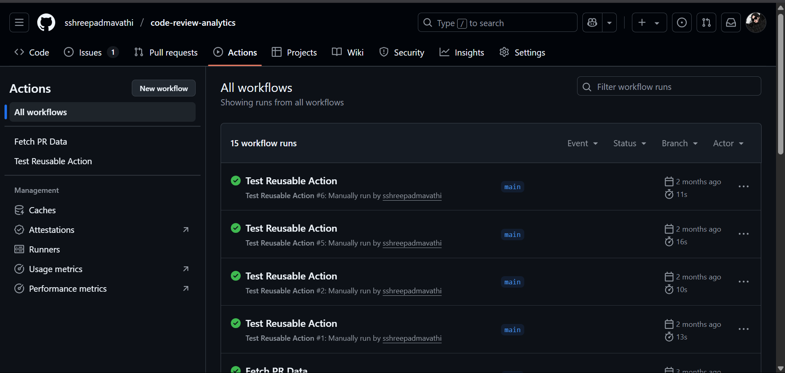

# 📊 Code Review Analytics

Analyze **GitHub Pull Request (PR) review patterns** to unlock insights about efficiency, response time, and PR complexity. This project transforms raw data into compelling visualizations to empower teams to streamline code reviews.

---

## 🚀 Why It Matters

Code reviews are crucial yet often opaque. How long do reviews take? Do bigger PRs stall the process? This project answers these questions using real GitHub data.

What you’ll discover:

- Review time trends and PR size correlations  
- Time-to-first-review analytics  
- Reviewer workload and distribution  
- PR size impact on review delay  
- Reproducible unit-tested scripts for reliable evaluation  

---

## ✨ Highlights & Insights

- Larger PRs take noticeably longer to review  
- Review times fluctuate wildly — some in minutes, others in days  
- Some PRs are never reviewed  
- Number of reviewers doesn’t always mean faster review  

---

## 📂 Repo Structure
```
code-review-analytics/
│
├── .github/ # GitHub Actions workflow
│ ├── use-reusable-action.yml # ✅ Reusable GitHub Action
│
├── images/ # 📊 Generated visualizations
│ ├── github_actions.png
│ ├── pr_review_distribution.png
│ ├── pr_size_vs_review_time.png
│ └── pull_request_data.png
│
├── analyze_pr_data.py # Data analysis + plot generation
├── generate_pr_data.py # GitHub API simulation script
├── pr_analysis.py # Statistical evaluation logic
├── test_fetch_pr_data.py # ✅ Unit tests for PR fetching
├── pull_requests.csv # Collected PR dataset
└── README.md # Project documentation
```

---

## 🖼️ Sample Visuals

### PR Review Time Distribution  


### PR Size vs Review Time  


### GitHub Actions Success  


### PR Dataset Snapshot  


---

## 🧪 Unit Tests

This repo includes unit tests using `unittest`, with mocked PR objects to validate functionality without hitting GitHub’s live API. It covers:

- Response structure
- Pagination handling
- Review submission extraction
- Edge case handling (e.g., 0 reviewers)

Run tests using:

```bash
python -m unittest test_fetch_pr_data.py
This workflow generates the CSV artifact and runs lint checks automatically on push or manual dispatch.
```
📈 Example Insights
Some PRs took over 14,000+ minutes for review

A few PRs were merged in under 10 minutes

Larger PRs → longer review duration (strong correlation)

Helpful for identifying review bottlenecks or overloaded reviewers

🛠️ Getting Started
```bash
# 1️⃣ Clone the repo
git clone https://github.com/sshreepadmavathi/code-review-analytics.git
cd code-review-analytics

# 2️⃣ (Optional) Install dependencies
pip install -r requirements.txt

# 3️⃣ Generate PR data (example dummy data)
python generate_pr_data.py

# 4️⃣ Run analysis
python analyze_pr_data.py
python pr_analysis.py
```

